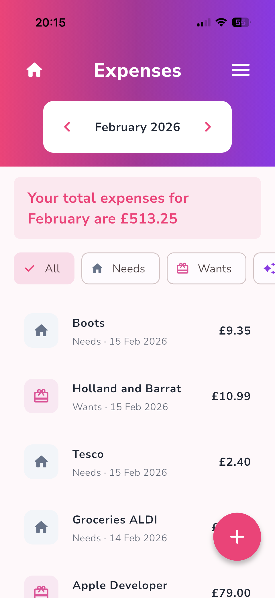
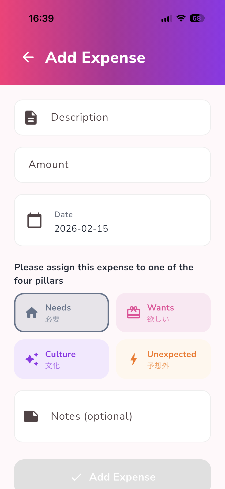
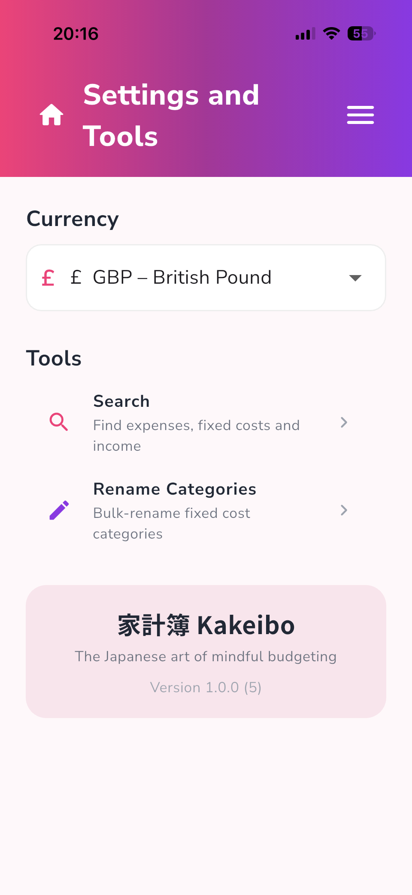
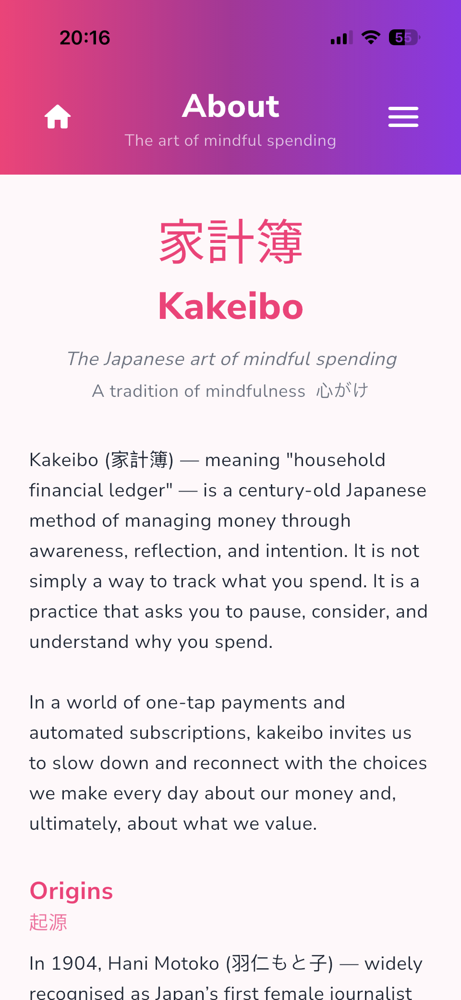
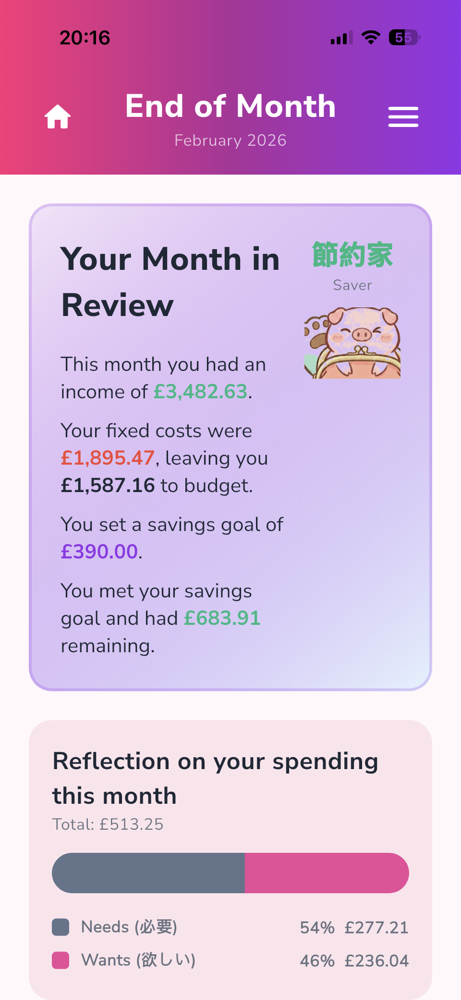

# Kakeibo

A mindful budgeting app inspired by the Japanese art of **Kakeibo** (家計簿) — the household financial ledger tradition created by journalist Hani Motoko in 1904.

Rather than just tracking expenses, Kakeibo encourages you to pause and reflect on *why* you spend, helping you develop a healthier relationship with money.

## Features

**The Four Pillars of Spending**
Every expense is categorised into one of four pillars, the foundation of the Kakeibo method:
- **Needs** (必要) — Essentials like groceries, utilities, transport
- **Wants** (欲しい) — Enjoyable but non-essential purchases
- **Culture** (文化) — Self-enrichment like books, courses, museums
- **Unexpected** (予想外) — Unforeseen costs like repairs or medical bills

**Monthly Budgeting**
- Multiple income sources
- Savings goal setting
- Visual budget bar showing savings, available funds, and spending
- Fixed costs management with category support

**Expense Tracking**
- Add, edit, and delete expenses
- Search across all months
- Swipe between dashboard, expenses, and fixed costs
- Import fixed costs from previous months

**End-of-Month Reflection**
- Guided reflection with four questions to review your spending
- See whether you hit your savings goal
- Track improvement strategies month to month

**Customisation**
- Multi-currency support (GBP, USD, EUR, JPY, and more)
- Renameable expense categories

## Privacy

Kakeibo stores all data locally on your device. No accounts, no cloud sync, no tracking. The only network request is fetching fonts from Google Fonts.

## Support

If you have a question or found a bug, please [open an issue](https://github.com/bradymd/kakeibo/issues).

If you find the app useful, you can support development via the in-app tip jar or [donate via PayPal](https://paypal.me/bradymd).

Visit the [Kakeibo Support Page](https://bradymd.github.io/kakeibo/) for more information.

## Screenshots

<table>
  <tr>
    <td align="center"><b>Dashboard</b> </td>
    <td align="center"><b>Expenses</b> </td>
    <td align="center"><b>Add Expense</b> </td>
  </tr>
  <tr>
    <td align="center"><b>Settings & Tools</b> </td>
    <td align="center"><b>About</b> </td>
    <td align="center"><b>End of Month</b> </td>
  </tr>
</table>

## Download

- **iOS** — Available on the App Store *(coming soon)*
- **Android** — Available on Google Play *(coming soon)*
